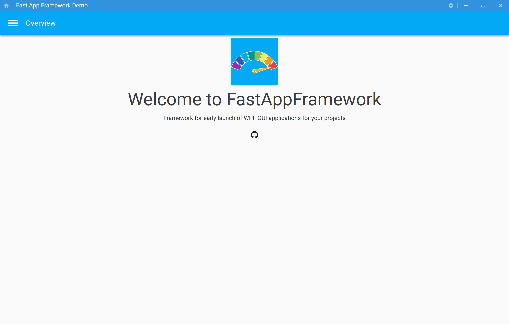
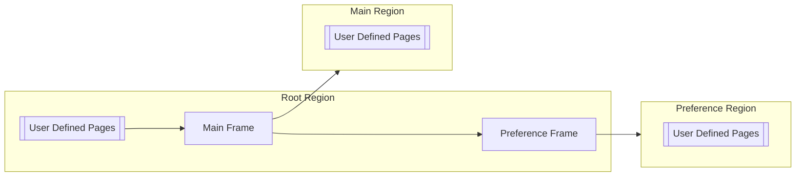
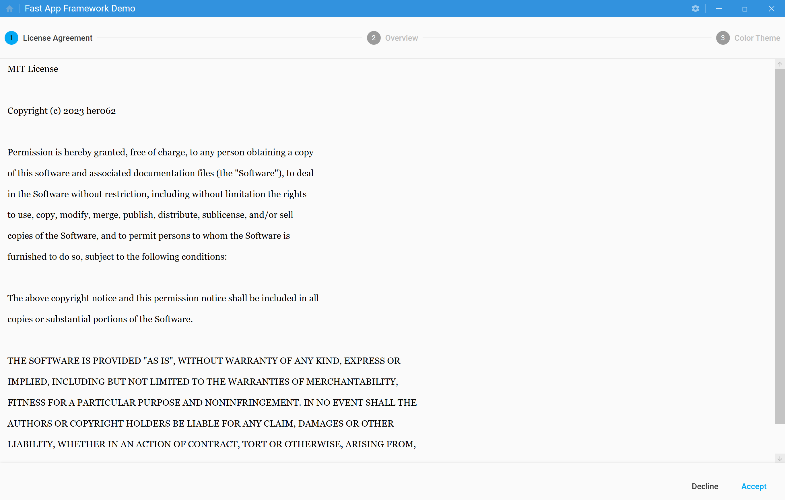
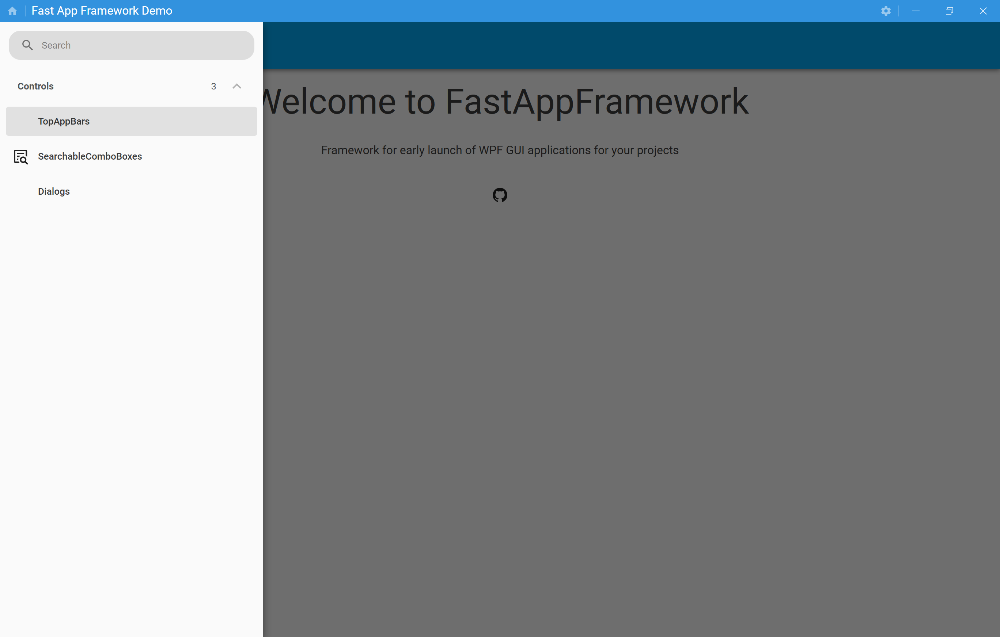
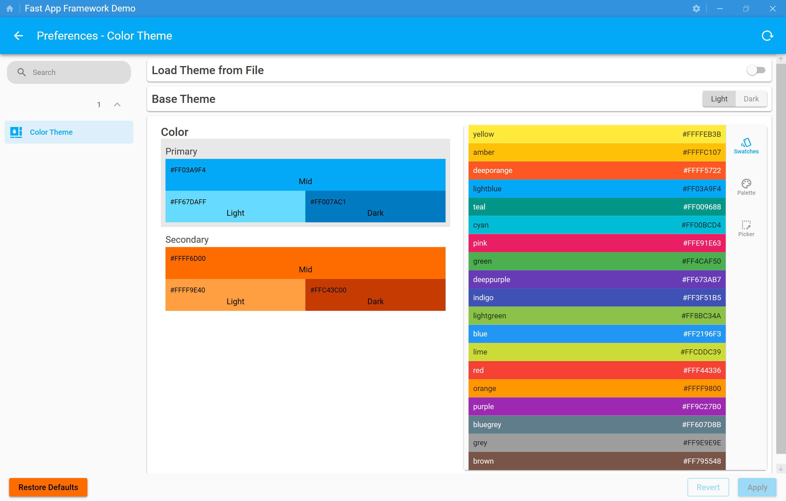
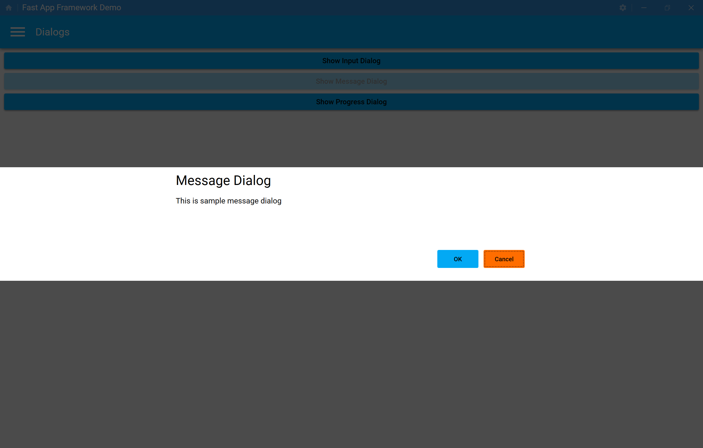
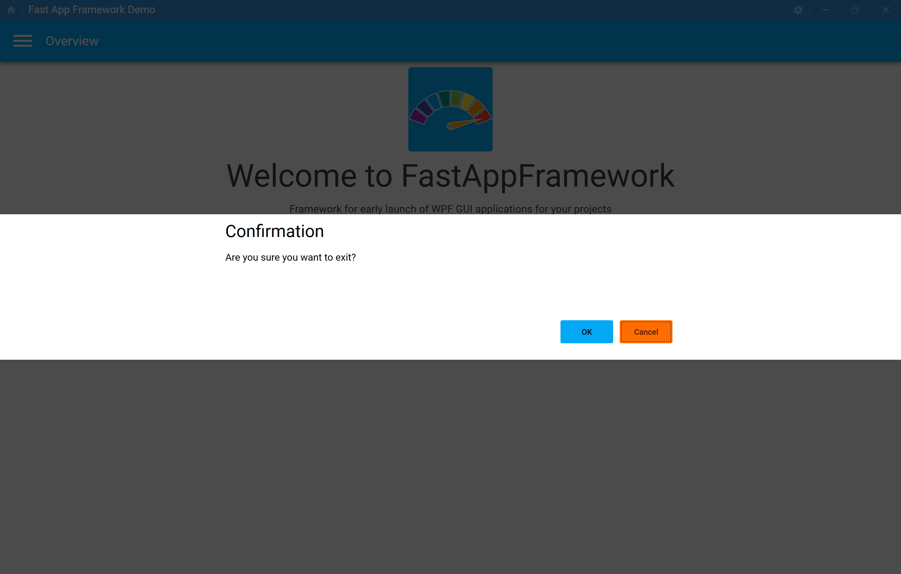

# FastAppFramework
Framework for early launch of WPF GUI applications for your projects


## Background
In the development of GUI applications using WPF, I always spent a lot of time to consider the basic screen structures and navigation mechanism for my applications.
Of course, I understand very good libraries for WPF GUI applications are available such as [Prism](https://github.com/PrismLibrary/Prism), [ReactiveProperty](https://github.com/runceel/ReactiveProperty), [Material Design In XML Toolkit](https://github.com/MaterialDesignInXAML/MaterialDesignInXamlToolkit), and so on.
However, I need to integrate these libraries to struct my application.

## Purpose
The purpose of `FastAppFramework` is providing the framework to simplify building base mechanisms in GUI application development.  
By using this framework, you can reap the benefits of being able to start developing your application's business model more faster.

## Getting Started
### Quick Start
1. Install `FastAppFramework.Wpf` to your WPF application project.
2. Edit `App.xaml` as below:
```xml
<faf:FastWpfApplication ...
    xmlns:faf="clr-namespace:FastAppFramework.Wpf;assembly=FastAppFramework.Wpf">
    <faf:FastWpfApplication.Config>
        <faf:ApplicationConfiguration />
    </faf:FastWpfApplication.Config>

    <Application.Resources>
        <ResourceDictionary>
            <ResourceDictionary.MergedDictionaries>
                <ResourceDictionary Source="pack://application:,,,/FastAppFramework.Wpf;component/Themes/Defaults.xaml" />
            </ResourceDictionary.MergedDictionaries>
        </ResourceDictionary>
    </Application.Resources>
</faf:FastWpfApplication>
```

3. Edit `App.xaml.cs` as below:
```csharp
using FastAppFramework.Wpf;
using Prism.Ioc;
...
public partial class App : FastWpfApplication
{
    protected override void RegisterNavigationTypes(IContainerRegistry containerRegistry)
    {
        base.RegisterNavigationTypes(containerRegistry);
        ...
    }

    protected override void RegisterSettingTypes(IApplicationSettingRegistry settingRegistry)
    {
        base.RegisterSettingTypes(settingRegistry);
        ...
    }
}
```

4. You can boot your application!

## Release Notes
Please refer [CHANGELOG](CHANGELOG.md).

## System Overview
### Screen Transition
#### Diagram

#### Embedded Regions
| Name | Description |
|:----:|:------------|
| Root Region | A Region to show top level views into the main window |
| Main Region | A Region to show main views into main frame |
| Preference Region | A Region to show preference editor views into preference frame |

#### Embedded Views
| Name | Description |
|:----:|:------------|
| Main Frame | A view displayed into Root Region. <br> This view has `Main Region` to navigate user defined main contents. |
| Preference Frame | A view displayed into Root Region. <br> This view has `Preference Region` to navigate user defined preference editor views. |

## Features
### View Navigation
In this framework, we use [Navigation Using the Prism Library](https://prismlibrary.com/docs/wpf/region-navigation/index.html) as the base mechanism.

#### Root Page Navigation


The default Root Page is `Main Frame`.
This means the user will look at any main content first when he/she boot you application.  
However in some times, you want to display another view at startup.
For example, the user should input some information follow the wizard before starting main procedures at first boot.  
You can change the startup view if you set `faf:ApplicationConfiguration.RootPage` in `App.xaml`.  
For example in the following code, `FirstWizardFrame` will be shown as the startup view.
```xml
<faf:ApplicationConfiguration RootPage="FirstWizardFrame" />
```
#### Main Contents Navigation
`Menu Navigation` and `Manual Navigation` are provided as the method for main contents navigation.  
First in either way, you need to register your class types as the target of navigation using `RegisterNavigationTypes` function in `App.xaml.cs`.  
For example in the following code, `OverviewPage` will be registered as the navigation target.
```csharp
public partial class App : FastWpfApplication
{
    ...
    protected override void RegisterNavigationTypes(IContainerRegistry containerRegistry)
    {
        base.RegisterNavigationTypes(containerRegistry);
        containerRegistry.RegisterForNavigation<OverviewPage, OverviewPageViewModel>();
    }
    ...
}
```

If `OverviewPage` is a sub class of `NavigationPage`, the text set in `OverviewPage.Title` will be displayed in the top application bar in `Main Frame` when `OverviewPage` appears.

##### Menu Navigation


If you give `NavigationPage` attribute to your view class as the following code, `Main` will be added in the main menu and you can navigate to this view.  
> **Note**
> You need to set `RegionType.Main` to `Region` property for the view of a main content.
```csharp
using FastAppFramework.Wpf;

[NavigationPage("Main", Region = NavigationPageAttribute.RegionType.Main)]
public partial class MainPage : NavigationPage
{
}
```

In addition, `Home` icon will be shown in the main menu if you give `MaterialDesignPageIcon` attribute as the following code.
```csharp
using FastAppFramework.Wpf;

[NavigationPage("Main", Region = NavigationPageAttribute.RegionType.Main), MaterialDesignPageIcon(MaterialDesignThemes.Wpf.PackIconKind.Home)]
public partial class MainPage : NavigationPage
{
}
```

##### Manual Navigation
You can navigate to any view by calling `IRegions.RequestNavigate` function.  
For example in the following code, `MainPage` will appears in `Main Frame`.
```csharp
var regionManager = FastWpfApplication.Current.Container.Resolve<IRegionManager>();
regionManager.Regions[FastWpfApplication.MainRegionName].RequestNavigate("MainPage");
```

#### Home Page Navigation
You can set a view as the home page if you set `faf:ApplicationConfiguration.HomePage` in `App.xaml` as the following code.
If you set it, you can quickly navigate to this view by clicking `Home` button in the application title bar.
```xml
<faf:ApplicationConfiguration HomePage="OverviewPage" />
```

The home page can change dynamically as the following code.
```csharp
FastWpfApplication.Current.Settings.SetValue(FastWpfApplication.HomePageSetting, "OtherPage");
```

#### Preference Editors Navigation


`Menu Navigation` and `Manual Navigation` are provided as the method for preference editors navigation.
It is same as [Main Contents Navigation](#Main-Contents-Navigation) how to register views as the navigation target.

##### Menu Navigation
If you give `NavigationPage` attribute to your view class as the following code, `General` will be added in the preference menu and you can navigate to this view.  
> **Note**
> You need to set `RegionType.Preference` to `Region` property for the view of a preference.

In addition, if your view class is a sub class of `PreferencePage`, this framework able to track property changes and validation errors in its view.
```csharp
using FastAppFramework.Wpf;

[NavigationPage("Color Theme", Region = NavigationPageAttribute.RegionType.Preference)]
public partial class ThemeSettingsPage : PreferencePage
{
}
```

##### Manual Navigation
You can navigate to any view by calling `IRegions.RequestNavigate` function.  
For example in the following code, `ThemeSettingsPage` will appears in `Preference Frame`.
```csharp
var regionManager = FastWpfApplication.Current.Container.Resolve<IRegionManager>();
regionManager.Regions[FastWpfApplication.PreferenceRegionName].RequestNavigate("ThemeSettingsPage");
```

### Dialogs


This framework recommend to use dialogs implemented in `MahApps.Metro`.
An instance of `IMetroDialogService` is registered in DI Container and you can use it by the following code.
```csharp
var service = FastWpfApplication.Current.Container.Resolve<IMetroDialogService>();
// Show message dialog.
var res = await service.ShowMessageAsync("Message Dialog", "This is sample message dialog", MessageDialogStyle.AffirmativeAndNegative);
// Show input dialog.
var input = await service.ShowInputAsync("Input", "Please input any text");
```

#### Application Exit Confirmation


In sometimes, you may want to confirm really okay to quit application if the user performs an action to quit the application(For example, Push `Close` button of the window).
The confirmation message dialog will be shown if you set `True` to `faf:ApplicationConfiguration.ExitConfirmation` in `App.xaml`.
And quiting the application process will be canceled if the user's answer is negative.
```xml
<faf:ApplicationConfiguration ExitConfirmation="True" />
```

In addition, you can change the behavior this confirmation procedures by overriding `Exiting` in `App.xaml.cs`
```csharp
public partial class App : FastWpfApplication
{
    ...
        public override async Task<bool> Exiting()
        {
            ...
        }
    ...
```

### Notify Icon


The notify icon will be added in the notification area if you set `True` to `faf:ApplicationConfiguration.HasNotifyIcon` in `App.xaml`.
An instance of `INotifyIconService` will be registered in DI Container and you can get it by the following code.
```xml
<faf:ApplicationConfiguration HasNotifyIcon="True" />
```
```csharp
var service = FastWpfApplication.Current.Container.Resolve<INotifyIconService>();
```

If your application has the notify icon, it won't quit even if you close the window.
Instead of, you can quit it by calling `Shutdown` function as the following code.
```csharp
// Quit the application.
Application.Current.Shutdown();
```

#### Icon in the notification area
In the default, the icon associated to your application executable file is shown in the notification area.
If you set `Icon` property of `INotifyIconService` as the following code, you can use any icon for the notify icon.
```csharp
var service = FastWpfApplication.Current.Container.Resolve<INotifyIconService>();
// Load the icon from file.
service.Icon = new Icon("C:\\temp.ico");
// Load the icon from embedded resource.
service.Icon = new Icon(Assembly.GetEntryAssembly().GetManifestResourceStream("notifyicon"));
```

#### ToolTip
In the default, the tooltip when the cursor hover on the notify icon is same as the title of window.
If you set `ToolTip` property of `INotifyIconService` as the following code, you can change the tooltip.
```csharp
var service = FastWpfApplication.Current.Container.Resolve<INotifyIconService>();
service.ToolTip = "Notify Icon ToolTip";
```

#### Double Click Command
In the default, the window will be shown & activated if you double click the notify icon.
If you set `DoubleClickCommand` property of `INotifyIconService` as the following code, you can change the behavior of the notify icon double clicking.
```csharp
var service = FastWpfApplication.Current.Container.Resolve<INotifyIconService>();
service.DoubleClickCommand = new ReactiveCommand().WithSubscribe(() => { MessageBox.Show("Notify Icon is double clicked"); });
```

#### Context Menu
Items on the context menu for the notify icon is constructed by `ContextMenuContainer`.
If you override `RegisterNotifyIconContextMenuItems` as the following code, you can add any items to the context menu.
> **Warning**
> Note that `Exit` won't be added to the context menu if you don't call `base.RegisterNotifyIconContextMenuItems(container)`.
```csharp
public partial class App : FastWpfApplication
{
    ...
    protected override void RegisterNotifyIconContextMenuItems(ContextMenuContainer container)
    {
        base.RegisterNotifyIconContextMenuItems(container);
        container.Add("Item 1", new ReactiveCommand().WithSubscribe(() => { MessageBox.Show("'Item 1' is clicked!"); }));
    }
    ...
}
```

### Application Settings
Application settings are stored in `%AppData%\<Application Assembly Name>\app.settings` as a json file and these are loaded when the application startup.  
For example in the following code, you can refer or change the value of an application setting.
```csharp
// Get the value of Home Page.
var homePage = FastWpfApplication.Current.Settings.GetValue<string>(FastWpfApplication.HomePageSetting);
// Set the value of Home Page.
FastWpfApplication.Current.Settings.SetValue(FastWpfApplication.HomePageSetting, "OtherPage")
```

#### Register Custom Settings
You can register your own settings in application settings by adding a statement into `RegisterSettingTypes` in `App.xaml.cs`.

##### Non-volatile settings
You can add a non-volatile setting by the statement like as the following code.
```csharp
// Register a string type non-volatile setting as 'test'(Default: <empty>).
settingRegistry.Register<string>("test", string.Empty);
```

You can add your own classes in application settings.
You need to implement these classes as able to serialize/deserialize by `Newtonsoft.Json`.
```csharp
// Register a ThemeSettings type non-volatile setting.
settingRegistry.Register<ThemeSettings>("theme", new ThemeSettings());
```

##### Volatile settings
You may notice `FastWpfApplication.HomePageSetting(='home')` is not stored in `app.settings` if you read this file.
This reason is this setting is defined as a volatile.  
You can add any settings as volatile by the statement like as the following code.
```csharp
// Register a string type volatile setting as 'test'(Default: <empty>).
settingRegistry.Register<string>("test", string.Empty, Variability.Volatile);
```

##### Immutable settings
You can add any settings as immutable by the statement like as the following code.
You cannot change the value of the immutable setting after registration and it will be stored in the application settings file.
This means the value at first implementation timing will be kept.  
If you set `Volatile` together, this is same as `static readonly` or `const` variables.
```csharp
// Register a date time of first startup application.
setting.Registry.Register<string>("startDate", DateTimeOffset.Now.ToString("yyyy-MM-dd'T'HH:mm:sszzz"), Variability.Immutable);
// Register immutable volatile setting.
setting.Registry.Register<string>("constName", "Sample Application", Variability.Immutable | Variability.Volatile);
```

#### Dependency Injection
Settings registered in `IApplicationSettingRegistry` are also registered in DI Container on `Prism`.
Therefore, The suitable instance of setting class type will be passed into the class that registered in DI Container if this constructor arguments has any setting class type.
```csharp
public class ThemeSettingsPageViewModel : CloneableModelBindingBase
{
    // The instance of ThemeSettings will be automatically resolved by DI Container.
    public ThemeSettingsPageViewModel(ThemeSettings model) : base(model, UpdateModelTrigger.Commit)
    {
        ...
    }
    ...
}
```

You can refer the instance of setting class type by the following code.
```csharp
var obj = FastWpfApplication.Current.Container.Resolve<ThemeSettings>();
```

However, the instance of setting class type will be changed if application settings are reloaded or restored as default.  
You don't need to worry for each classes for [Preference Editors Navigation](#Preference-Editors-Navigation) because these instances will be reloaded after above operations.  
If you refer any instance of application settings for other behaviors, I suggest you the following code as a solution.
```csharp
// Refer the instance of a setting as a ReactiveProperty, and detect changes instance.
var setting = FastWpfApplication.Current.Settings.Observe<ThemeSettings>(o => o.Property1).ToReadOnlyReactivePropertySlim().AddTo(this);
// Refer the property in a setting as a ReactiveProperty.
var property1 = setting.ObserveProperty(v => v.Value!.Property1).ToReadOnlyReactivePropertySlim().AddTo(this);
```

#### Version Controls
If you give `ApplicationSetting` attribute as the following code, you can set the schema version of this setting.
```csharp
[ApplicationSetting(Version = "1.0")]
public class ThemeSettings : CloneableModelBase
{
    ...
}
```

This schema version will be stored in the application settings file.  
If you change the major version on this attribute, values in the application settings file will be ignored.
I hope you can reap the benefits by this control if you have any breaking changes relate to this setting.

### Logging
In this framework, we use [Microsoft.Extensions.Logging.ILogger](https://learn.microsoft.com/en-us/dotnet/api/microsoft.extensions.logging.ilogger?view=dotnet-plat-ext-7.0) for logging.
If you want to record any log, the following code is simplest way to get the instance of `Microsoft.Extensions.Logging.ILogger`.
```csharp
// Get ILogger from Application Instance and record an information log.
App.Current.Logger.LogInformation("Logging Sample");
```

In addition, `ILogger` instance is registered in DI Container on `Prism`.
So, you can also get it in the constructor of classes registered in there.
```csharp
public class ThemeSettingsPageViewModel : CloneableModelBindingBase
{
    // The instance of ThemeSettings will be automatically resolved by DI Container.
    public ThemeSettingsPageViewModel(ThemeSettings model, ILogger logger) : base(model, UpdateModelTrigger.Commit)
    {
        logger.LogInformation("Logging Sample");
        ...
    }
    ...
}
```

#### Output Destination
In the default, the log will be stored in `%USERPROFILE%\AppData\Local\Temp\<Application Assembly Name>\logs\<yyyyMMdd>.log` if the severity level is greater or equals `Information`.
Also, all log will be output in the console.

| Level | Logging Method | Output to File | Output to Console |
|:-----:|:---------------|:----:|:-------:|
| Trace | LogTrace | :x: | :white_check_mark: |
| Debug | LogDebug | :x: | :white_check_mark: |
| Information | LogInformation | :white_check_mark: | :white_check_mark: |
| Warning | LogWarning | :white_check_mark: | :white_check_mark: |
| Error | LogError | :white_check_mark: | :white_check_mark: |
| Critical | LogCritical | :white_check_mark: | :white_check_mark: |

#### Customize Configuration
##### Change File Path
The path of application log file is defined as `IApplicationEnvironment.LogFolder`.
You can change this path if you create a custom class realizing `IApplicationEnvironment` and overwrite the following function.
```csharp
public partial class App : FastWpfApplication
{
    protected override IApplicationEnvironment SetupEnvironment()
    {
        ...
    }
}
```

##### Change ILogger
`ILogger` instance is created in `FastApplication.CreateLogger`.
You can change the text format, output destination, and so on if you overwrite this function to return your own defined instance.
```csharp
public partial class App : FastWpfApplication
{
    protected override ILogger CreateLogger()
    {
        ...
    }
}
```

## Dependencies
### FastAppFramework.Core
* [Prism.DryIoc](https://www.nuget.org/packages/Prism.DryIoc)
  Uses for Dependency Injection, View Navigation, Module Expansion, and so on.
* [NLog.Extensions.Logging](https://www.nuget.org/packages/NLog.Extensions.Logging)
  Uses for the file logging.
* [Newtonsoft.Json](https://www.nuget.org/packages/Newtonsoft.Json)
  Uses for application settings serialization.
### FastAppFramework.Wpf
* [ReactiveProperty](https://www.nuget.org/packages/ReactiveProperty)
* [MaterialDesignThemes.MahApps](https://www.nuget.org/packages/MaterialDesignThemes.MahApps)
* [MahApps.Metro](https://www.nuget.org/packages/MahApps.Metro)
* [Hardcodet.NotifyIcon.Wpf](https://www.nuget.org/packages/Hardcodet.NotifyIcon.Wpf)
