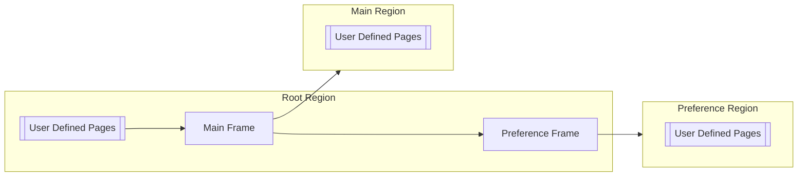

TODO: Not translated in English, yet.

# FastAppFramework
Framework for early launch of WPF GUI applications for your projects

## Background
I developed some GUI applications using WPF.
In these development, I always spent a lot of time to consider the basic screen structures and navigation mechanism for my applications.
Of course, I understand very good libraries for WPF GUI applications are available such as [Prism](https://github.com/PrismLibrary/Prism), [ReactiveProperty](https://github.com/runceel/ReactiveProperty), [Material Design In XML Toolkit](https://github.com/MaterialDesignInXAML/MaterialDesignInXamlToolkit), and so on.
However, I need to integrate these libraries to fit my application requirements.

WPFによるGUIアプリケーション開発では、設定の読み込みや保存、ログの記録、画面遷移の仕組みといったベースメカニズムの構築や、画面構成の検討に多くの時間を費やさなくてはならない。
Prism/ReactiveProperty/MaterialDesignInXMLToolkitのように数多くの優れたライブラリがあるが、これらのライブラリで提供される個々の強力で独立的な機能は、アプリケーション側で統合しなければ十分に活用することが出来ない。

## Purpose
`FastAppFramework` は、アプリケーション開発におけるベースメカニズムの構築、統一的な画面構成の検討を省略し、アプリケーションの本来の目的であるビジネスモデルの構築にいち早く取り掛かるためのフレームワークを提供する事を目的としている。

## Getting Started
### Quick Start
1. Install `FastAppFramework.Wpf` to your WPF application project.
2. Edit `App.xaml` as below:
```xml
<faf:FastWpfApplication ...
    xmlns:faf="clr-namespace:FastAppFramework.Wpf;assembly=FastAppFramework.Wpf">
    <faf:FastWpfApplication.Config>
        <faf:ApplicationConfiguration />
    </faf:FastWpfApplication.Config>

    <Application.Resources>
        <ResourceDictionary>
            <ResourceDictionary.MergedDictionaries>
                <ResourceDictionary Source="pack://application:,,,/FastAppFramework.Wpf;component/Themes/Defaults.xaml" />
            </ResourceDictionary.MergedDictionaries>
        </ResourceDictionary>
    </Application.Resources>
</faf:FastWpfApplication>
```

3. Edit `App.xaml.cs` as below:
```csharp
using FastAppFramework.Wpf;
using Prism.Ioc;
...
public partial class App : FastWpfApplication
{
    protected override void RegisterNavigationTypes(IContainerRegistry containerRegistry)
    {
        base.RegisterNavigationTypes(containerRegistry);
        ...
    }

    protected override void RegisterSettingTypes(IApplicationSettingRegistry settingRegistry)
    {
        base.RegisterSettingTypes(settingRegistry);
        ...
    }
}
```

4. You can boot your application!

## Release Notes
Please refer [CHANGELOG](CHANGELOG.md).

## System Overview
### Screen Transition
#### Diagram

#### Embedded Regions
| Name | Description |
|:----:|:------------|
| Root Region | A Region to show top level views into the main window |
| Main Region | A Region to show main views into main frame |
| Preference Region | A Region to show preference editor views into preference frame |

#### Embedded Views
| Name | Description |
|:----:|:------------|
| Main Frame | An view displayed into Root Region. <br> This view has `Main Region` to navigate user defined main contents. |
| Preference Frame | An view displayed into Root Region. <br> This view has `Preference Region` to navigate user defined preference editor views. |

## Features
### View Navigation
画面遷移には、[Prismが提供する仕組み](https://prismlibrary.com/docs/wpf/region-navigation/index.html)をベースメカニズムとして利用する。

#### Root Page Navigation
The default Root Page is `Main Frame`.
This means the user will look at any main content first when he/she boot you application.  
However in some times, you want to display another view at startup.
For example, the user should input some information follow the wizard before starting main procedures at first boot.

`App.xaml` 内で `faf:ApplicationConfiguration.RootPage` を指定することで初期画面を変更出来る。  
例えば下記の場合、`FirstWizardPage` が初期画面として表示されるようになる。
```xml
<faf:ApplicationConfiguration RootPage="FirstWizardPage" />
```

#### Main Contents Navigation
メインコンテンツの遷移には `Menu Navigation`, `Manual Navigation` の2つの方法がある。
どちらの方法でも、`App.xaml.cs` 内の `RegisterNavigationTypes` で、クラス型をナビゲーションの対象として登録する必要がある。  
例えば下記の場合、`MainPage`がナビゲーションの対象として登録される。
```csharp
protected override void RegisterNavigationTypes(IContainerRegistry containerRegistry)
{
    base.RegisterNavigationTypes(containerRegistry);
    containerRegistry.RegisterForNavigation<MainPage>();
}
```

ここで、`MainPage` が `NavigationPage` を継承している場合には、該当のページが表示された時に `NavigationPage.Title` に設定された内容が `Main Frame` のアプリケーションバーに表示されるようになる。

##### Menu Navigation
下記のように `NavigationPage` 属性を付与することで、メインメニューに `Main` という項目が表示され、画面遷移できるようになる。
```csharp
using FastAppFramework.Wpf;

[NavigationPage("Main", Region = NavigationPageAttribute.RegionType.Main)]
public partial class MainPage : NavigationPage
{
}
```

また、`MaterialDesignPageIcon` 属性を付与することで、メニュー内にアイコンが表示されるようになる。
```csharp
using FastAppFramework.Wpf;

[NavigationPage("Main", Region = NavigationPageAttribute.RegionType.Main), MaterialDesignPageIcon(MaterialDesignThemes.Wpf.PackIconKind.Home)]
public partial class MainPage : NavigationPage
{
}
```

##### Manual Navigation
下記のような処理を実行することで、`Main Frame` で `MainPage` が表示されるように画面遷移される。
```csharp
var regionManager = FastWpfApplication.Current.Container.Resolve<IRegionManager>();
regionManager.Regions[FastWpfApplication.MainRegionName].RequestNavigate("MainPage");
```

#### Home Page Navigation
`App.xaml` 内で `faf:ApplicationConfiguration.HomePage` を指定することで、ホーム画面を設定出来る。  
ホーム画面を設定する事で、タイトルバーのホームボタンをクリックすることでいつでもホーム画面を表示出来るようになる。
```xml
<faf:ApplicationConfiguration HomePage="MainPage" />
```

また、下記のように設定することで、アプリケーションの動作中にホーム画面を変更できる。
```csharp
FastWpfApplication.Current.Settings.SetValue(FastWpfApplication.HomePageSetting, "OtherPage");
```

#### Preference Editors Navigation
設定エディタも、メインコンテンツと同様に `Menu Navigation`, `Manual Navigation` の2つの方法があり、クラス型をナビゲーションの対象として登録する方法はメインコンテンツと同一である。

##### Menu Navigation
下記のように `NavigationPage` 属性を付与することで、設定メニューに `General` という項目が表示され、画面遷移できるようになる。
```csharp
using FastAppFramework.Wpf;

[NavigationPage("General", Region = NavigationPageAttribute.RegionType.Preference)]
public partial class GeneralPreferencePage : PreferencePage
{
}
```

ここで、`GeneralPreferencePage` が `PreferencePage` を継承している場合には、該当ページ内の変更やエラーの有無を追跡できるようになる。

##### Manual Navigation
下記のような処理を実行することで、`Preference Frame` で `GeneralPreferencePage` が表示されるように画面遷移される。
```csharp
var regionManager = FastWpfApplication.Current.Container.Resolve<IRegionManager>();
regionManager.Regions[FastWpfApplication.PreferenceRegionName].RequestNavigate("GeneralPreferencePage");
```

### Application Settings
アプリケーション設定は `%AppData%\<Application Assembly Name>\app.settings` にjson形式で保存される。
ファイルに保存されている設定は、アプリケーション起動時に自動的に読み込まれる。  
下記のような処理を実行することで、プロジェクト内の任意のソースコードからアプリケーション設定を参照・変更することが出来る。
```csharp
// Get the value of Home Page.
var homePage = FastWpfApplication.Current.Settings.GetValue<string>(FastWpfApplication.HomePageSetting);
```

#### Register Custom Settings
アプリケーション独自の設定を定義するためには、`App.xaml.cs` 内の `RegisterSettingTypes` に処理を追加する必要がある。

##### Non-volatile settings
下記のような処理を追加することで、不揮発性の設定を追加することが出来る。
```csharp
// Register a string type non-volatile setting as 'test'(Default: <empty>).
settingRegistry.Register<string>("test", string.Empty);
```

また、独自のクラス型を追加することも出来る。
ただし、不揮発性の設定は、`Newtonsoft.Json` でシリアライズ・デシリアライズ出来る必要がある。
```csharp
// Register a CustomSettings type non-volatile setting.
settingRegistry.Register<CustomSettings>();
```

##### Volatile settings
ここまでの説明で使用した `FastWpfApplication.HomePageSetting('home')` が `app.settings` に保存されていない事に気づいたと思う。  
これは、該当項目が揮発性の設定として定義されているためである。
揮発性の設定は、シリアライズの対象から除外され、設定ファイルに保存されない。  
下記のように定義することで、揮発性の設定を追加することが出来る。
```csharp
// Register a string type volatile setting as 'test'(Default: <empty>).
settingRegistry.Register<string>("test", string.Empty, Variability.Volatile);
```

##### Immutable settings
TODO: Not described, yet.

#### Dependency Injection
`IApplicationSettingRegistry` で登録された設定は、`Prism`の DI Container にも自動的に登録される。
そのため、ViewModel型のコンストラクタ引数に追加されている場合には、自動的に型解決され、適切なインスタンスが渡される。
また、下記のような処理を実行することで、インスタンスを取得することも出来る。
```csharp
var obj = FastWpfApplication.Current.Container.Resolve<CustomSettings>();
```

#### Version Controls
TODO: Not described, yet.

### Logging
TODO: Not described, yet.

## Dependencies
### FastAppFramework.Core
* [Prism.DryIoc](https://www.nuget.org/packages/Prism.DryIoc)
  Uses for Dependency Injection, View Navigation, Module Expansion, and so on.
* [NLog.Extensions.Logging](https://www.nuget.org/packages/NLog.Extensions.Logging)
  Uses for the file logging.
* [Newtonsoft.Json](https://www.nuget.org/packages/Newtonsoft.Json)
  Uses for application settings serialization.
### FastAppFramework.Wpf
* [ReactiveProperty](https://www.nuget.org/packages/ReactiveProperty)
* [MaterialDesignThemes.MahApps](https://www.nuget.org/packages/MaterialDesignThemes.MahApps)
* [MahApps.Metro](https://www.nuget.org/packages/MahApps.Metro)